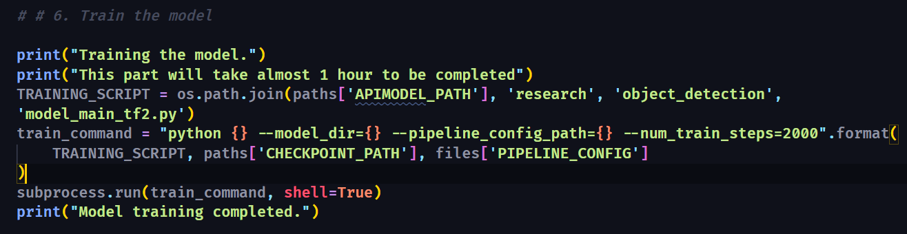
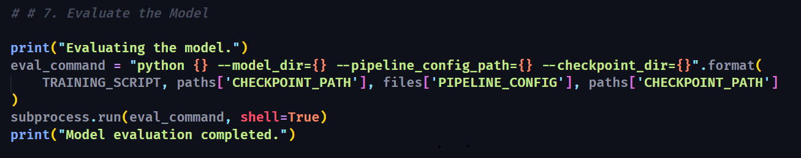
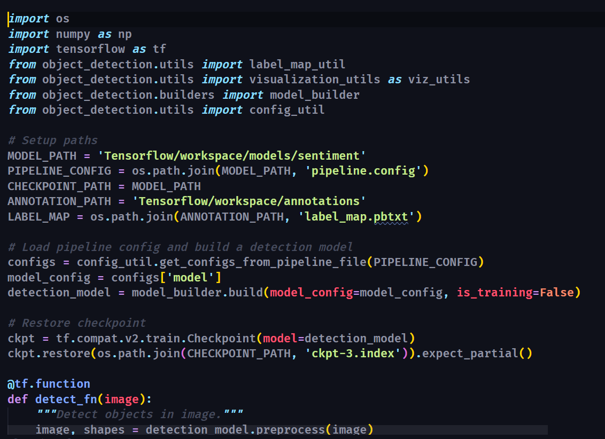
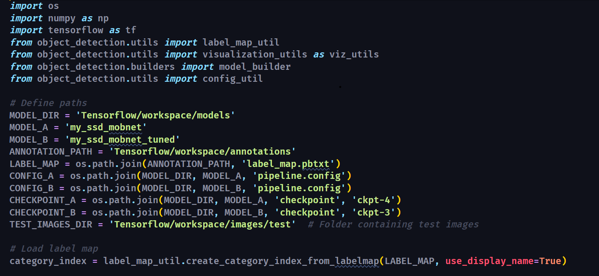
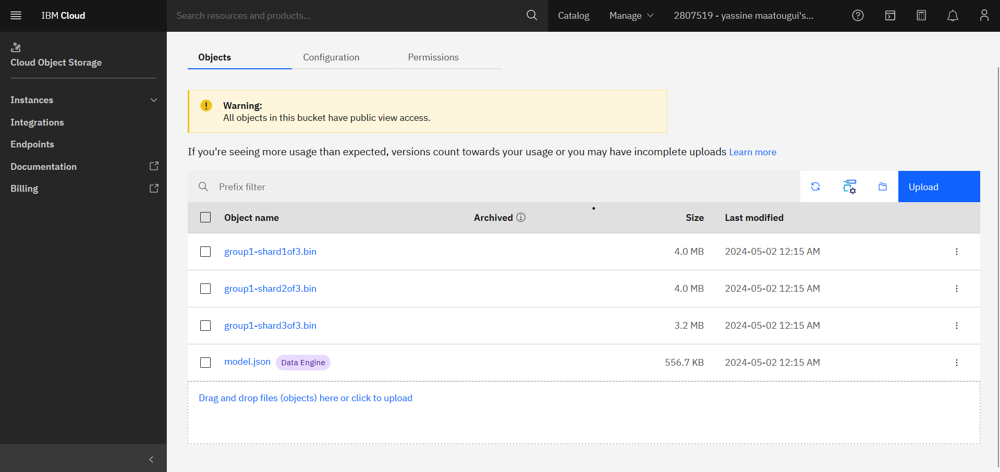
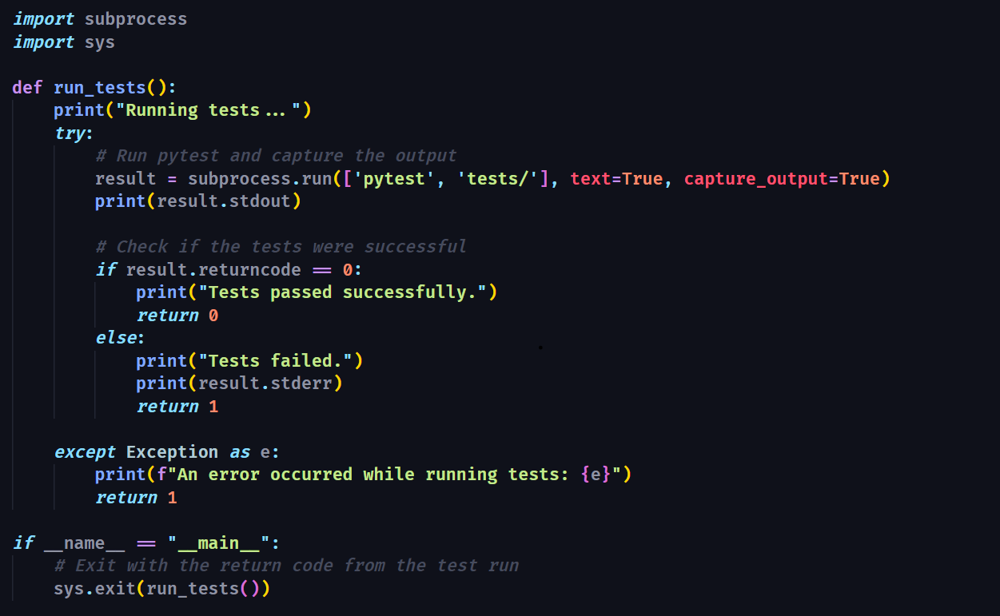
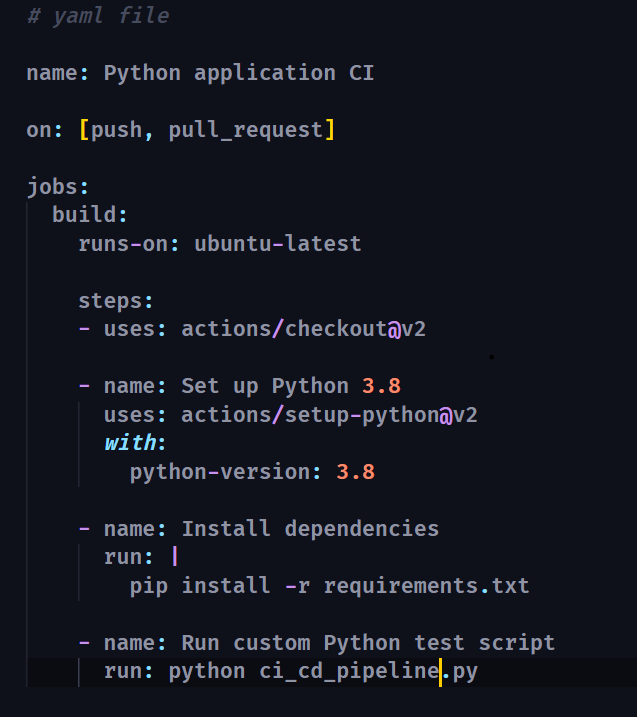

# Face Sentiment Detection System
==============================

A Face Sentiment Detection system that employs machine learning to accurately recognize and analyze facial expressions for emotion detection. This project utilizes the power of TensorFlow and TFLite on a Raspberry Pi, making it highly efficient for real-time applications.

## Introduction

My Face Sentiment Detection System is at the forefront of emotion recognition technology. By focusing on facial sentiment analysis, our solution opens new avenues for interactive applications, customer service enhancements, and emotional research. This project demonstrates our commitment to innovative use of TensorFlow Object Detection and TFLite on resource-constrained devices like the Raspberry Pi.

## Project Overview

This README outlines the development journey of our Face Sentiment Detection System, detailing technical specifics, application areas, the importance of machine learning, data handling, evaluation metrics, and performance benchmarks.

## Table of Contents

- [Getting Started](#getting-started)
- [Problem Specification](#problem-specification)
- [Data Requirements](#data-requirements)
- [Evaluation Metrics](#evaluation-metrics)
- [Comparative Analysis](#comparative-analysis)
- [License](#license)

## Getting Started

Explore the sections below to gain a comprehensive understanding of the project scope and its objectives.

### Problem Specification

#### Model Overview

Our system is built upon TensorFlow's advanced machine learning models, optimized for facial recognition and sentiment analysis tasks. It is designed to detect and interpret facial expressions in real-time, offering accurate emotion recognition capabilities.

### Application Areas

Face Sentiment Detection can revolutionize various sectors, including:
- **Customer Service**: Enhancing interaction quality by reading customer emotions.
- **Security**: Identifying suspicious or anomalous behaviors based on facial sentiments.
- **Healthcare**: Monitoring patient emotions for better psychological assessment.

### Importance of Machine Learning

Machine learning enables our system to learn from diverse facial expressions, improving its accuracy and adaptability in real-world applications. This continuous learning process ensures the system remains effective across different demographics and lighting conditions.

## Data Requirements

### Nature of Data

Our model relies on a vast dataset of facial images, each annotated with corresponding emotions. This dataset includes a wide range of expressions across various ages, ethnicities, and environments to ensure comprehensive learning.

### Data Sources

The dataset amalgamates open-source libraries, proprietary data, and anonymized user contributions, fostering a rich learning environment for the model.

### Data Preprocessing

Images undergo preprocessing to normalize lighting, align faces, and resize images, ensuring uniformity and improving model performance.

## Evaluation Metrics

### Key Metrics

- **Accuracy**: Measures the system's ability to correctly identify emotions.
- **Response Time**: Critical for real-time applications, indicating the speed of emotion recognition.
- **Adaptability**: The system's effectiveness across different facial expressions, lighting conditions, and demographics.

### Objective Alignment

These metrics ensure our system meets the high standards required for accurate, efficient, and universal face sentiment detection.

## Comparative Analysis

### Existing Solutions

Our system aims to surpass current technologies by enhancing detection accuracy, reducing latency, and ensuring adaptability to various real-world scenarios.

### Benchmarks

Setting new standards in emotion recognition, our project focuses on achieving unparalleled accuracy and response times, thereby establishing new benchmarks in the field.

## License

This project is made available under the [MIT License](LICENSE), supporting open collaboration and modification.

Project Organization
------------

    ├── LICENSE
    ├── Makefile           <- Makefile with commands like `make data` or `make train`
    ├── README.md          <- The top-level README for developers using this project.
    ├── data
    │   ├── external       <- Data from third party sources.
    │   ├── interim        <- Intermediate data that has been transformed.
    │   ├── processed      <- The final, canonical data sets for modeling.
    │   └── raw            <- The original, immutable data dump.
    │
    ├── docs               <- A default Sphinx project; see sphinx-doc.org for details
    │
    ├── models             <- Trained and serialized models, model predictions, or model summaries
    │
    ├── notebooks          <- Jupyter notebooks. Naming convention is a number (for ordering),
    │                         the creator's initials, and a short `-` delimited description, e.g.
    │                         `1.0-jqp-initial-data-exploration`.
    │
    ├── references         <- Data dictionaries, manuals, and all other explanatory materials.
    │
    ├── reports            <- Generated analysis as HTML, PDF, LaTeX, etc.
    │   └── figures        <- Generated graphics and figures to be used in reporting
    │
    ├── requirements.txt   <- The requirements file for reproducing the analysis environment, e.g.
    │                         generated with `pip freeze > requirements.txt`
    │
    ├── setup.py           <- makes project pip installable (pip install -e .) so src can be imported
    ├── src                <- Source code for use in this project.
    │   ├── __init__.py    <- Makes src a Python module
    │   │
    │   ├── data           <- Scripts to download or generate data
    │   │   └── make_dataset.py
    │   │
    │   ├── features       <- Scripts to turn raw data into features for modeling
    │   │   └── build_features.py
    │   │
    │   ├── models         <- Scripts to train models and then use trained models to make
    │   │   │                 predictions
    │   │   ├── predict_model.py
    │   │   └── train_model.py
    │   │
    │   └── visualization  <- Scripts to create exploratory and results oriented visualizations
    │       └── visualize.py
    │
    └── tox.ini            <- tox file with settings for running tox; see tox.readthedocs.io

--------

<small>Project based on the <a target="_blank" href="https://drivendata.github.io/cookiecutter-data-science/">cookiecutter data science project template</a>. #cookiecutterdatascience</small>

## Milestone 3

- **Data Validation**: Implemented TensorFlow Data Validation (TFDV) to ensure the quality of input data, identify any anomalies, and validate the data schema.
- **Data Pipeline**: Set up a robust data pipeline using TensorFlow Transform (TFT) for efficient data preprocessing and feature engineering.
- **Feature Store**: Integrated a feature store for consistent feature management and to facilitate the machine learning pipeline's feature serving needs.

## Milestone 4: ML Pipeline Development and Testing

This milestone focuses on the integration of machine learning pipeline components including model training, evaluation, and testing.

### Training, Evaluating, and Testing Scripts

- **Training Script**: Implemented using TensorFlow's Trainer component to handle model training.
- **Evaluation Script**: Uses the Evaluator component to assess model performance.
- **Testing Scripts**: Behavioral tests developed using Pytest to verify functionality under various conditions.

Here's the script that includes training and evaluation of the model:

- **Testing scripts**:

Simple testing:

A/B Testing:

## Milestone 5: Model Deployment (Front-end and Containerization)

- **Front-End Development**: Developed a responsive front-end application using React.js to display real-time sentiment analysis results.
- **Containerization**: Utilized Docker for packaging and containerizing the application to ensure consistent and reproducible deployments.

Result:

- **Containerization**:

## Milestone 6: CI/CD Pipeline Integration

- **CI/CD Pipeline**: Implemented a CI/CD pipeline using GitHub Actions to automate the training, testing, and deployment processes, ensuring continuous integration and delivery of updates.

CI/CD pipeline Script:

YAML file:

## Milestone 7: Monitoring and Continual Learning

This milestone focuses on ensuring sustained model performance and efficiency through continuous monitoring and automated updates.

### Resource Monitoring

- **Energy Efficiency Measurement**: Monitors and measures the model's energy consumption during training and inference to optimize the system's energy efficiency. For instance, we calculate energy consumed in Joules and convert it to kilowatt-hours (kWh) for practical understanding

### Model Performance Monitoring and Data Drift Detection

- **Performance Monitoring**: Uses Evidently AI to monitor model performance and detect significant shifts in data distribution, helping maintain model accuracy over time.
- **Data Drift Detection**: Continuous monitoring for data distribution drift ensures the model adapts to changes in input data characteristics.

### Continual Learning: CT/CD Pipeline

- **Continuous Training/Continuous Deployment (CT/CD)**: Ensures the model is continuously updated with new data, automatically retraining and deploying without manual intervention. GitHub Actions automate the retraining process whenever new data is available or periodically based on a schedule.

### Pipeline Orchestration

- **Apache Airflow**: Orchestrates the workflow of the ML pipeline, managing tasks such as data ingestion, preprocessing, model training, evaluation, and deployment. This coordination ensures that the ML pipeline operates smoothly and efficiently.

## Responsible AI (Milestone 8 - Optional, 15% Bonus)

### Evaluation Beyond Accuracy

- **Audit Model for Bias**: Regular audits to identify and mitigate any biases in the model to ensure fair and ethical use.
- **Model Explainability and Interpretability**: Implement methods to make the model's decisions transparent and understandable to stakeholders.

## Conclusion

### Summary of Achievements

Developed a sophisticated ML system for face sentiment detection, leveraging advanced models and a robust pipeline, achieving high accuracy in detecting emotional states.

### Lessons Learned

Emphasized the critical role of high-quality data and the impact of efficient data pipeline management in achieving high model performance.

### Future Directions

Plan to enhance the model's capability to recognize a broader range of emotions and subtle expressions, integrate newer and more efficient ML models, and expand the application areas of the system.

## References

1. TensorFlow Documentation: Comprehensive insights into TensorFlow APIs and functionalities.
 - [TensorFlow](https://www.tensorflow.org/)
2. TFX User Guide: Detailed documentation on implementing TFX components.
 - [TFX User Guide](https://www.tensorflow.org/tfx)
3. Prometheus Documentation: Information on monitoring system metrics.
 - [Prometheus](https://prometheus.io/docs/)
4. Evidently AI: Tools for monitoring model performance and data distribution drift.
 - [Evidently AI](https://evidentlyai.com/)
5. Apache Airflow Documentation: Guidelines on defining, executing, and monitoring DAGs.
 - [Apache Airflow](https://airflow.apache.org/docs/)
6. GitHub Actions Documentation: Comprehensive guides on setting up and managing CI/CD workflows.
 - [GitHub Actions](https://docs.github.com/en/actions)
7. Docker Documentation: Understanding Docker commands and best practices.
 - [Docker](https://docs.docker.com/)
8. Cassandra Documentation: Insights into Cassandra's data model and query language.
 - [Apache Cassandra](https://cassandra.apache.org/doc/latest/)
9. TensorFlow Serving with Docker: Configuration and optimization of TensorFlow Serving with Docker.
 - [Serving TensorFlow Models](https://www.tensorflow.org/tfx/guide/serving)
