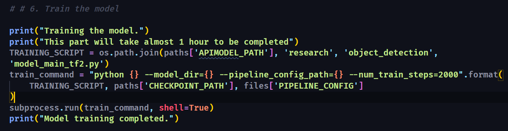

# Face Sentiment Detection System
==============================

A Face Sentiment Detection system that employs machine learning to accurately recognize and analyze facial expressions for emotion detection. This project utilizes the power of TensorFlow and TFLite on a Raspberry Pi, making it highly efficient for real-time applications.

## Introduction

My Face Sentiment Detection System is at the forefront of emotion recognition technology. By focusing on facial sentiment analysis, our solution opens new avenues for interactive applications, customer service enhancements, and emotional research. This project demonstrates our commitment to innovative use of TensorFlow Object Detection and TFLite on resource-constrained devices like the Raspberry Pi.

## Project Overview

This README outlines the development journey of our Face Sentiment Detection System, detailing technical specifics, application areas, the importance of machine learning, data handling, evaluation metrics, and performance benchmarks.

## Table of Contents

- [Getting Started](#getting-started)
- [Problem Specification](#problem-specification)
- [Data Requirements](#data-requirements)
- [Evaluation Metrics](#evaluation-metrics)
- [Comparative Analysis](#comparative-analysis)
- [License](#license)

## Getting Started

Explore the sections below to gain a comprehensive understanding of the project scope and its objectives.

### Problem Specification

#### Model Overview

Our system is built upon TensorFlow's advanced machine learning models, optimized for facial recognition and sentiment analysis tasks. It is designed to detect and interpret facial expressions in real-time, offering accurate emotion recognition capabilities.

### Application Areas

Face Sentiment Detection can revolutionize various sectors, including:
- **Customer Service**: Enhancing interaction quality by reading customer emotions.
- **Security**: Identifying suspicious or anomalous behaviors based on facial sentiments.
- **Healthcare**: Monitoring patient emotions for better psychological assessment.

### Importance of Machine Learning

Machine learning enables our system to learn from diverse facial expressions, improving its accuracy and adaptability in real-world applications. This continuous learning process ensures the system remains effective across different demographics and lighting conditions.

## Data Requirements

### Nature of Data

Our model relies on a vast dataset of facial images, each annotated with corresponding emotions. This dataset includes a wide range of expressions across various ages, ethnicities, and environments to ensure comprehensive learning.

### Data Sources

The dataset amalgamates open-source libraries, proprietary data, and anonymized user contributions, fostering a rich learning environment for the model.

### Data Preprocessing

Images undergo preprocessing to normalize lighting, align faces, and resize images, ensuring uniformity and improving model performance.

## Evaluation Metrics

### Key Metrics

- **Accuracy**: Measures the system's ability to correctly identify emotions.
- **Response Time**: Critical for real-time applications, indicating the speed of emotion recognition.
- **Adaptability**: The system's effectiveness across different facial expressions, lighting conditions, and demographics.

### Objective Alignment

These metrics ensure our system meets the high standards required for accurate, efficient, and universal face sentiment detection.

## Comparative Analysis

### Existing Solutions

Our system aims to surpass current technologies by enhancing detection accuracy, reducing latency, and ensuring adaptability to various real-world scenarios.

### Benchmarks

Setting new standards in emotion recognition, our project focuses on achieving unparalleled accuracy and response times, thereby establishing new benchmarks in the field.

## License

This project is made available under the [MIT License](LICENSE), supporting open collaboration and modification.

Project Organization
------------

    ├── LICENSE
    ├── Makefile           <- Makefile with commands like `make data` or `make train`
    ├── README.md          <- The top-level README for developers using this project.
    ├── data
    │   ├── external       <- Data from third party sources.
    │   ├── interim        <- Intermediate data that has been transformed.
    │   ├── processed      <- The final, canonical data sets for modeling.
    │   └── raw            <- The original, immutable data dump.
    │
    ├── docs               <- A default Sphinx project; see sphinx-doc.org for details
    │
    ├── models             <- Trained and serialized models, model predictions, or model summaries
    │
    ├── notebooks          <- Jupyter notebooks. Naming convention is a number (for ordering),
    │                         the creator's initials, and a short `-` delimited description, e.g.
    │                         `1.0-jqp-initial-data-exploration`.
    │
    ├── references         <- Data dictionaries, manuals, and all other explanatory materials.
    │
    ├── reports            <- Generated analysis as HTML, PDF, LaTeX, etc.
    │   └── figures        <- Generated graphics and figures to be used in reporting
    │
    ├── requirements.txt   <- The requirements file for reproducing the analysis environment, e.g.
    │                         generated with `pip freeze > requirements.txt`
    │
    ├── setup.py           <- makes project pip installable (pip install -e .) so src can be imported
    ├── src                <- Source code for use in this project.
    │   ├── __init__.py    <- Makes src a Python module
    │   │
    │   ├── data           <- Scripts to download or generate data
    │   │   └── make_dataset.py
    │   │
    │   ├── features       <- Scripts to turn raw data into features for modeling
    │   │   └── build_features.py
    │   │
    │   ├── models         <- Scripts to train models and then use trained models to make
    │   │   │                 predictions
    │   │   ├── predict_model.py
    │   │   └── train_model.py
    │   │
    │   └── visualization  <- Scripts to create exploratory and results oriented visualizations
    │       └── visualize.py
    │
    └── tox.ini            <- tox file with settings for running tox; see tox.readthedocs.io

--------

<small>Project based on the <a target="_blank" href="https://drivendata.github.io/cookiecutter-data-science/">cookiecutter data science project template</a>. #cookiecutterdatascience</small>

## Milestone 3

- **Data Validation**: Implemented TensorFlow Data Validation (TFDV) to ensure the quality of input data, identify any anomalies, and validate the data schema.
- **Data Pipeline**: Set up a robust data pipeline using TensorFlow Transform (TFT) for efficient data preprocessing and feature engineering.
- **Feature Store**: Integrated a feature store for consistent feature management and to facilitate the machine learning pipeline's feature serving needs.

## Milestone 4: ML Pipeline Development and Testing

This milestone focuses on the integration of machine learning pipeline components including model training, evaluation, and testing.

### Training and Testing Script

Here's the script that includes training and evaluation of the model:

## Milestone 5: Model Deployment (Front-end and Containerization)

- **Front-End Development**:

Developed a responsive front-end application using React.js to display real-time sentiment analysis results.

Result:

- **Containerization**:

Packaged the application and model using Docker to streamline deployment and ensure consistency across different environments.

## Milestone 6: CI/CD Pipeline Integration

CI/CD pipeline Script:

YAML file:

